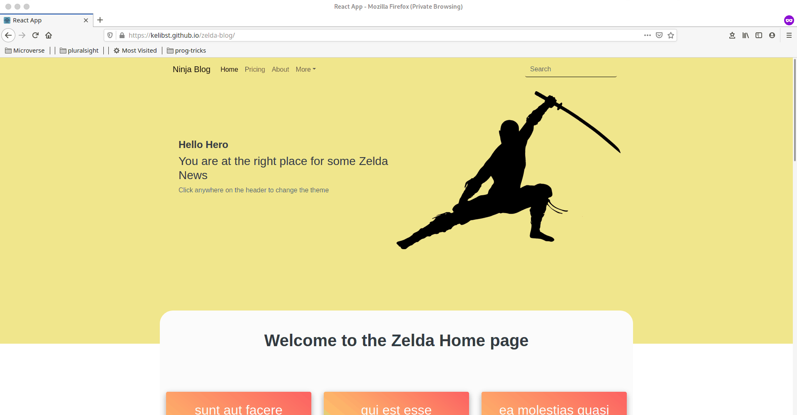

# zelda-blog
A basic Blog page using React and Redux. 
Fetches Post form Json placeholder and display them on the page using.


# Screenshot


# Live Demo
[Live Demo Link](https://kelibst.github.io/) 


# Built With

- HTML 
- CSS
- JAVASCRIPT
- NPM
- REACT
- NODE
- HEROKU
- ESLINT
- STYLELINT
- GITHUB ACTIONS
- REDUX

### Usage
- Clone the project 
```
git clone https://github.com/kelibst/react_calc.git
```
- Run `npm install` to install the local dependencies
- Run `npm start` to launch local development server
- The project should launch in your default browser

- Open [http://localhost:3000](http://localhost:3000) to view it in the browser.

- The page will reload if you make edits.<br />
- You will also see any lint errors in the console.


## Authors

👤 **Kelly Booster**

- Github: [@kelibst](https://github.com/kelibst)
- Twitter: [@keli_booster](https://twitter.com/keli_booster)
- Linkedin: [Kekeli (Jiresse) Dogbevi
](https://www.linkedin.com/in/kekeli-dogbevi-jiresse/)


# 🤝 Contributing
Contributions, issues and feature requests are welcome!
Feel free to check the issues page

# Show your support
Give a ⭐️ if you like this project!

This project is [MIT](lic.url) licensed.

